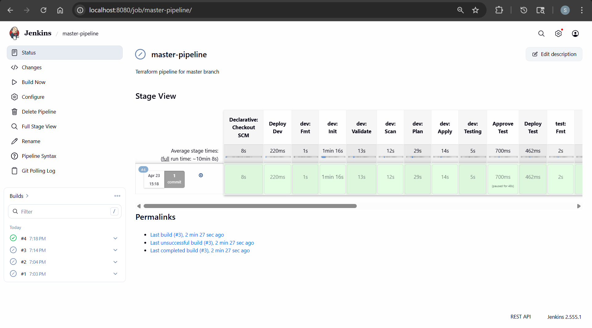
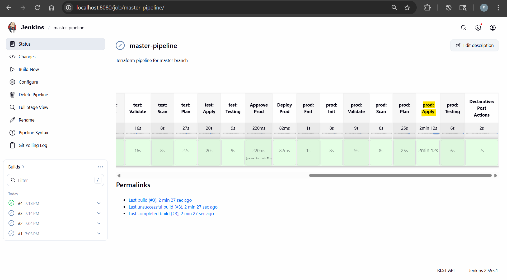
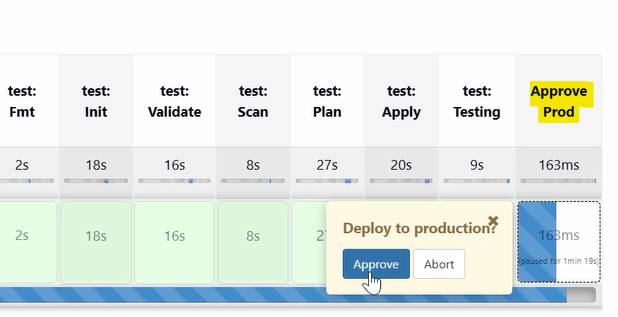
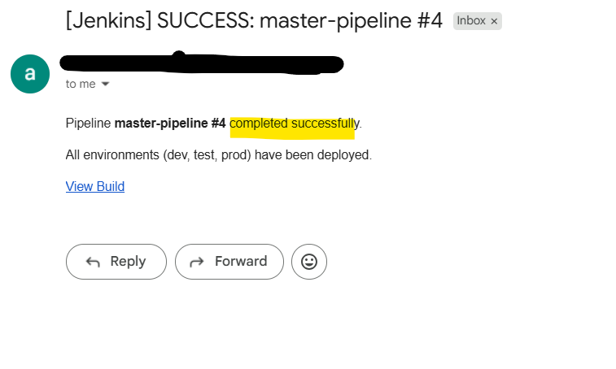

# Jenkins Demo: Terraform Multi-Environment Pipeline

> A production-style CI/CD pipeline that provisions AWS infrastructure across multiple environments using Terraform, Jenkins on Kubernetes, and automated security scanning.

- [Jenkins Demo: Terraform Multi-Environment Pipeline](#jenkins-demo-terraform-multi-environment-pipeline)
  - [DevOps CI/CD Pipeline Design](#devops-cicd-pipeline-design)
  - [Jenkins Best Practices on Kubernetes](#jenkins-best-practices-on-kubernetes)
  - [Security \& Secrets Management](#security--secrets-management)
  - [Pipeline in Action](#pipeline-in-action)

---

## DevOps CI/CD Pipeline Design

- **Multi-environment promotion**:
  - Sequential `Dev` → `Test` → `Prod` pipeline with isolated S3 **remote state per environment**
- **Production safety gate**:
  - Manual approval step blocks Prod deploy until explicitly confirmed
- **Infrastructure as Code**:
  - Terraform with reusable custom VPC module, variable validation, plan/apply separation

- **Pipeline Architecture:**

```txt
Pipeline: Terraform Environment Promotion
Trigger: Master Branch Merge

| Stage | Env    | Flow                                                |
+-------+--------+-----------------------------------------------------+
|  1    | Dev    | [Trigger] --> [TerraformDeploy] --> [Dev Test]      |
|  2    | Test   |               [TerraformDeploy] --> [Test Test]     |
|  3    | Prod   | [Admin Approval] --> [TerraformDeploy]              |

Shared Library: TerraformDeploy
| terraform fmt | -> | terraform init | -> | terraform validate | -> | trivy scan | -> | terraform plan  | -> | terraform apply |
```

---

## Jenkins Best Practices on Kubernetes

- **Helm deployment**:
  - Jenkins provisioned as K8s StatefulSet via Helm chart — no manual server setup
- **Configuration as Code (JCasC)**:
  - Credentials, plugins, and system config declared in `values.yaml` — fully reproducible
- **Reusable Shared Library**:
  - `terraformDeploy()` abstracts pipeline logic into reusable functions
- **Kubernetes Pod Agents**:
  - Build runs in ephemeral K8s pods with multiple containers (Terraform, AWS CLI, Trivy)

- **Jenkins Configurations diagram**

```txt
                        +---------------------------+
                        |       Helm values         |
                        +---------------------------+
                                      |
                                      v
                        +---------------------------+
                        |          JCasC            |
                        +---------------------------+
                                      |
                                      v
                        +---------------------------+
                        |   Jenkins in Kubernetes   |
                        +---------------------------+
                        |             |             |
                        v             v             v
            +-----------+      +------+------+      +------------+
            | Libraries |      | PodTemplate |      |    Jobs    |
            +-----------+      +-------------+      +------------+
                 |                    |                    |
                 v                    v                    v
      +--------+--------+ +-----------+----------+ +-----------+----------+
      |terraformDeploy()| |Pod Agent             | |Pipeline (Github repo)|
      |                 | |(Terraform,AWS,Trivy) | |                      |
      +-----------------+ +----------------------+ +----------------------+
```

---

## Security & Secrets Management

- **Shift-left security**:
  - Trivy IaC scan runs before `plan`/`apply` — misconfigurations caught in CI, not production
- **Secrets hygiene**:
  - AWS keys, GitHub token, and email credentials stored in K8s Secrets → injected as Jenkins credentials — zero hardcoded secrets in pipeline code

```txt
Zero Hardcoded Secrets

+------------------+     +-------------------+     +----------------------+
|   K8s Secrets    | --> |  Jenkins Pod Env  | --> | Jenkins Credentials  |
|                  |     |                   |     |                      |
| - AWS keys       |     |  (mounted at      |     | - AWS keys           |
| - GitHub token   |     |   pod startup)    |     | - GitHub token       |
| - Email creds    |     |                   |     | - Email creds        |
+------------------+     +-------------------+     +----------------------+
                                                              |
                                                             used by
                                                              |
                                                    +--------------------+
                                                    |  Pipeline Code     |
                                                    |  (no secrets)      |
                                                    +--------------------+
```

---

## Pipeline in Action

- Pipeline





- Production Approval



- Notification


